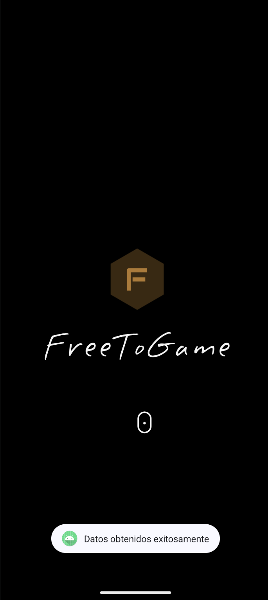
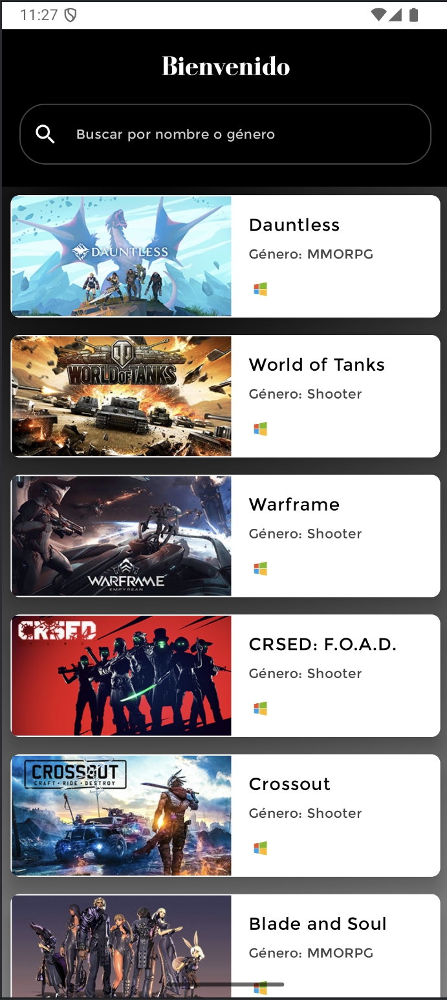
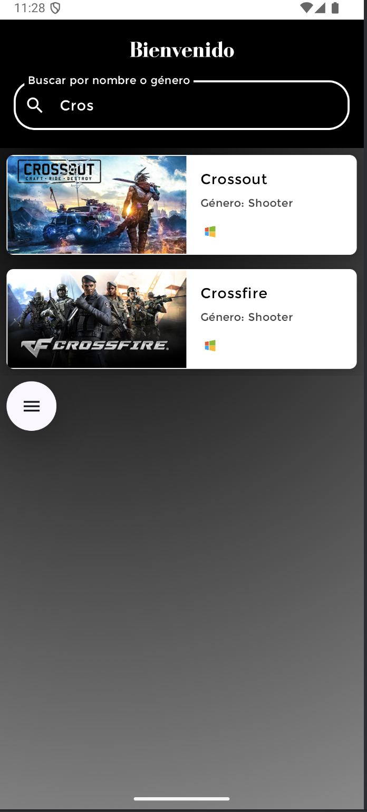
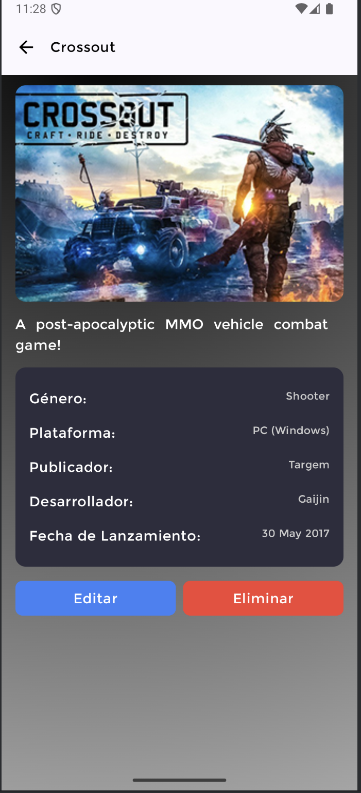
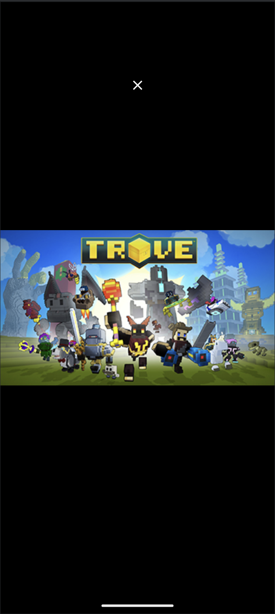

# FreeToGameApp

FreeToGame App es una aplicación de Android desarrollada en Kotlin utilizando el patrón de diseño MVVM y Clean Architecture, con Jetpack Compose para la interfaz de usuario. La aplicación permite explorar una lista de videojuegos gratuitos obtenidos de una API externa, con opciones de búsqueda, filtrado y administración de una base de datos local. Se han implementado principios de diseño limpio, incluyendo la separación de capas (Repository, Use Cases, Data Sources), uso de Dagger Hilt para la inyección de dependencias, Retrofit para llamadas de red, Room para almacenamiento local, y corutinas y flows para la gestión asíncrona de datos.

# Tecnologías utilizadas
	Kotlin
	Jetpack Compose - Interfaz de usuario declarativa.
	MVVM - Arquitectura de patrón de diseño.
	Dagger Hilt - Inyección de dependencias.
	Retrofit - Llamadas de red.
	Coroutines & Flows - Programación asíncrona.
	Room Database - Almacenamiento local.
	Sealed Classes - Mapeo de respuestas API.
# Estructura del Proyecto
La app está estructurada en capas con Repository y RepositoryImpl, LocalDataSource y RemoteDataSource, así como UseCases para cada función de negocio, organizando el código de manera clara y mantenible.

# Funcionalidades principales
	- Splash Screen: Llama a la API al iniciar y guarda los datos en la base de datos local.
	- Lista de Videojuegos: Muestra una lista de videojuegos almacenados localmente.
	- Campo de Búsqueda y Filtro: Permite buscar y filtrar videojuegos en tiempo real.
	- Detalle del Videojuego: Visualiza, edita o elimina los detalles de un videojuego.
# Pantallas
A continuación se describe cada pantalla de la aplicación:

# 1. Splash Screen
En esta pantalla inicial, se realiza la llamada a la API para obtener los videojuegos, y se almacenan en la base de datos local.

# 2. Lista de Videojuegos
Pantalla principal donde se muestra la lista de videojuegos cargados desde la base de datos local. Incluye una barra de búsqueda para localizar videojuegos específicos y un filtro para ordenar o limitar los resultados según tus preferencias.

# 3. Pantalla de Búsqueda y Filtro
Integra un campo de texto para búsqueda dinámica y un botón de filtro para organizar los videojuegos según distintos criterios.

# 4. Detalle del Videojuego
Muestra la información detallada del videojuego seleccionado. Desde aquí, el usuario puede optar por editar o eliminar el videojuego.

# 5. Zoom de l aimagen del videojuego
Al hacer click en la imagen del videojuego desde la pantalla de detalle, se puede abrir en un modal y hacer zoom.

# Instalación y Uso
	- Clona el repositorio.
	- Abre el proyecto en Android Studio.
	- Sincroniza las dependencias y ejecuta el proyecto en un dispositivo o emulador Android.
